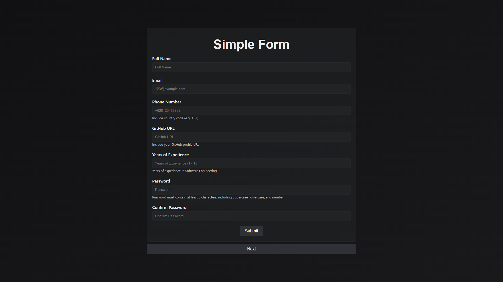

<!-- Improved compatibility of back to top link: See: https://github.com/othneildrew/Best-README-Template/pull/73 -->
<a name="readme-top"></a>
<!--
*** Thanks for checking out the Best-README-Template. If you have a suggestion
*** that would make this better, please fork the repo and create a pull request
*** or simply open an issue with the tag "enhancement".
*** Don't forget to give the project a star!
*** Thanks again! Now go create something AMAZING! :D
-->


<!-- PROJECT SHIELDS -->
<!--
*** I'm using markdown "reference style" links for readability.
*** Reference links are enclosed in brackets [ ] instead of parentheses ( ).
*** See the bottom of this document for the declaration of the reference variables
*** for contributors-url, forks-url, etc. This is an optional, concise syntax you may use.
*** https://www.markdownguide.org/basic-syntax/#reference-style-links
-->


<!-- PROJECT LOGO -->
<br />
<div align="center">
  <a href="https://github.com/ValentinoTriadi/Technical-Test-Purple-Box">
    
  </a>
  <h1>Purple Box Form</h1>
  <p align="center">
    A Simple Form Application
    <br />
    <a href="https://github.com/ValentinoTriadi/Technical-Test-Purple-Box"><strong>Explore the docs »</strong></a>
    ·
    <a href="https://github.com/ValentinoTriadi/Technical-Test-Purple-Box/issues">Report Bug</a>
    <br/>
  </p>
</div>


<!-- TABLE OF CONTENTS -->
<details>
  <summary>Table of Contents</summary>
  <ol>
    <li>
      <a href="#about-the-project">About The Project</a>
      <ul>
        <li><a href="#built-with">Built With</a></li>
        <li><a href="#features">Features</a></li>
      </ul>
    </li>
    <li><a href="#requirement">Requirement</a></li>
    <li><a href="#usage">Usage</a></li>
    <li><a href="#Project-Status">Project Status</a></li>
    <li><a href="#Room-for-Improvement">Room for Improvement</a></li>
    <li><a href="#Acknowledgments">Acknowledgments</a></li>
  </ol>
</details>


<!-- ABOUT THE PROJECT -->
## About The Project



This Project is a simple form application with custom field validator using vanilla JS and react-hook-form. This project implement react-redux as the state storage and make it persist state with react-redux-persist.

<br/>


<p align="right">(<a href="#readme-top">back to top</a>)</p>


### Built With
|Tools & Library|Version|
|:----------------:|:-------:|
|       [React](https://react.dev/)      | ^18.3.1 |
| [@reduxjs/toolkit](https://redux-toolkit.js.org/) |  ^2.2.6 |
|       [redux](https://redux.js.org/)      |  ^5.0.1 |
|    [react-redux](https://react-redux.js.org/)   |  ^9.1.2 |
|   [redux-persist](https://www.npmjs.com/package/redux-persist)  |  ^6.0.0 |


<br/>

### Features

* Simple Form
* Custom Field Validator
* Persist State
* Responsive Design
* Reusable Components
* Reusable validation function

<p align="right">(<a href="#readme-top">back to top</a>)</p>


<!-- Requirement Dependencies -->
## Requirements

1. <a href="https://nodejs.org/en/download/package-manager">Node 20</a>
    

<p align="right">(<a href="#readme-top">back to top</a>)</p>


<!-- USAGE EXAMPLES -->
## Usage

1. Clone the repo
   ```sh
   git clone https://github.com/ValentinoTriadi/Technical-Test-Purple-Box.git
   ```
2. ```sh
   cd website
   ```
3. ```sh
   npm install
   ```
4. ```sh
   npm start
   ```
5. Enjoy!

<p align="right">(<a href="#readme-top">back to top</a>)</p>


## Deployment

Application is deployed on Vercel on [```https://sea-salon-theta.vercel.app/```](https://sea-salon-theta.vercel.app/)
<br/>
<p align="right">(<a href="#readme-top">back to top</a>)</p>


<!-- PROJECT STATUS -->
## Project Status
Project status: _complete_ 
<br/>
<p align="right">(<a href="#readme-top">back to top</a>)</p>

<!-- ROOM FOR IMPROVEMENT -->
## Room for Improvement
- Improve Interface UI
<br/>
<p align="right">(<a href="#readme-top">back to top</a>)</p>


<!-- ACKNOWLEDGMENTS -->
## Acknowledgments
* [Valentino Chryslie Triadi](https://github.com/ValentinoTriadi)

[![LinkedIn][linkedin-shield-valen]][linkedin-valen]

<p align="right">(<a href="#readme-top">back to top</a>)</p>


<!-- MARKDOWN LINKS & IMAGES -->
<!-- https://www.markdownguide.org/basic-syntax/#reference-style-links -->
[linkedin-shield-valen]: https://img.shields.io/badge/Linkedin-Valentino%20Triadi-000000?style=for-the-badge&logo=linkedin&logoColor=white
[linkedin-valen]: https://linkedin.com/in/valentino-triadi